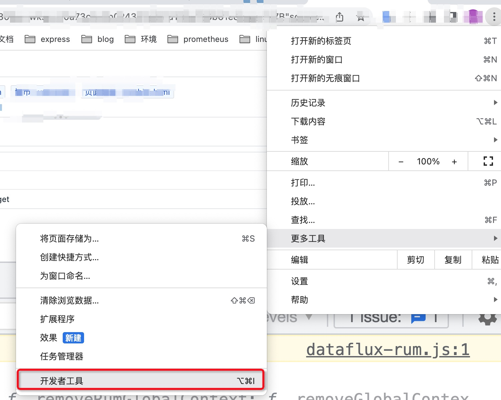
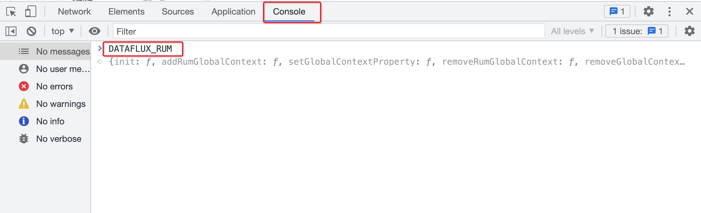
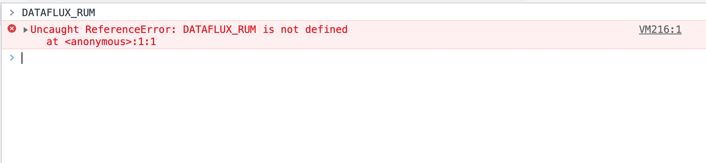
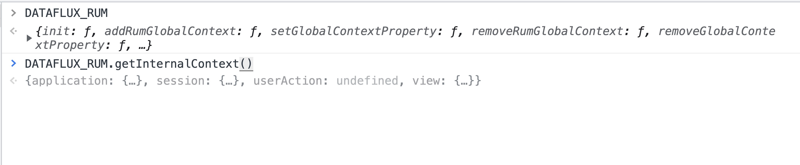
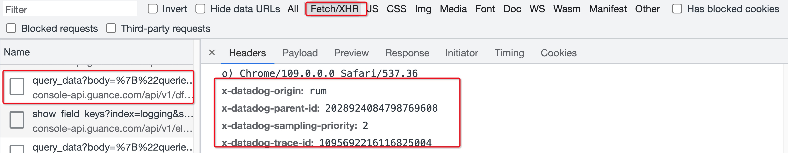

# 故障排除

## 如何确定 RUM SDK 初始化成功

1. 打开浏览器控制台



2. 检查对象`DATAFLUX_RUM`是否存在

存在：



不存在：



3. 执行`DATAFLUX_RUM.getInternalContext()`检查对象是否初始化成功



如果初始化成功，则可以获取到当前应用页面对应的 `session`, `application`, `view` 等对象信息

## 初始化失败

1. 如果是以 CDN 的方式接入，确定当前应用是否为 `https` 站点。
2. 确定[配置]()是否正确, (包括配置参数的格式，以及名称)。

## 初始化成功，数据不上报、或者上报数据不全

1. 检查浏览器版本信息，确定[浏览器支持列表](./browser-support.md)对应数据是否支持
2. 检查 RUM 浏览器 SDK 的初始化位置，并考虑在应用程序代码中尽可能 **提前** 执行初始化操作

## XHR/FETCH 请求没有和 APM 链路关联

检查初始化配置中 `allowedTracingOrigins` 配置是否开启，确认格式是否正确。(**如果以正则的方式配置，需确定数组里面配置的不是字符串，而是正则表达式**)

正确
 ```js
datafluxRum.init({
    applicationId: '<DATAFLUX_APPLICATION_ID>',
    datakitOrigin: '<DATAKIT ORIGIN>',
    env: 'production',
    version: '1.0.0',
    trackInteractions: true,
    allowedTracingOrigins: [/https:\\/\\/.*\\.my-api-domain\\.com/] // 正则不能有引号
})
```
错误
 ```js
datafluxRum.init({
    applicationId: '<DATAFLUX_APPLICATION_ID>',
    datakitOrigin: '<DATAKIT ORIGIN>',
    env: 'production',
    version: '1.0.0',
    trackInteractions: true,
    allowedTracingOrigins: ["/https:\\/\\/.*\\.my-api-domain\\.com/"]
})
```

## 如何确认 APM 和 前端 XHR/FETCH 关联成功

1. 打开浏览器控制台
2. 确认 XHR/FETCH 请求的 Request Headers，是否包含对应[请求头关键字](application-performance-monitoring/collection/connect-web-app/)信息， 如下图为 ddtrace 相关请求头
   

   
