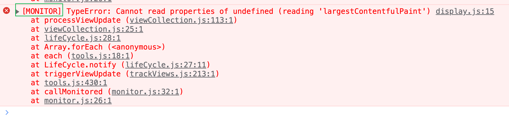

目前对于 SDK 自身错误的自监控已经开发测试完毕。

为了验证方案的可行性 ，以及准确性。可以通过如下方式验证：

我们提供一个测试的 SDK ，该 SDK 在自监控的逻辑基础上，保留了之前发现的错误 bug。
SDK 测试 CDN 地址 (`https://static.guance.com/browser-sdk/v3/dataflux-rum-test.js`）

测试步骤如下：
- 对 SDK 开启 debug 模式（该模式下会把自监控产生的错误通过浏览器控制台以错误日志的方式显示）开启方法：
  ```js
  window.DATAFLUX_RUM &&
    window.DATAFLUX_RUM.init({
        ...
    });
    window.DATAFLUX_RUM &&  window.DATAFLUX_RUM._setDebug(true)// 默认不开启，后续我们会把自监控产生的错误上报到我们自监控平台
  ```
错误日志如下格式（以 `[MONITOR]` 前缀开头）

- 复现之前出现 bug 的场景，验证是否会出现之前影响当前业务的情况。